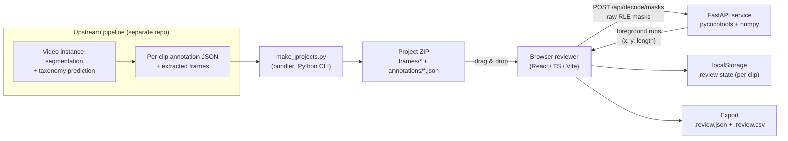

# Video Segmenter — Tracklet & Label Review Platform

> An interactive, browser-based quality-control (QC) platform for **video instance segmentation** output.
> Human reviewers load a per-clip **project archive**, scrub through the frames, verify each object **tracklet's mask** frame-by-frame, confirm or correct its **taxonomic label** (kingdom → species), and export a structured review report that can be fed back into dataset curation and model re-training.

This document is written for **researchers and engineers who will maintain and extend the platform**. It describes the motivation, the architecture, the data contract, the implementation techniques, and how to run and extend every part of the system.

---

## Table of Contents

1. [What this project is (and is not)](#what-this-project-is-and-is-not)
2. [High-level architecture](#high-level-architecture)
3. [Repository layout](#repository-layout)
4. [The project archive (data contract)](#the-project-archive-data-contract)
5. [The annotation JSON schema](#the-annotation-json-schema)
6. [Backend — mask decoding service](#backend--mask-decoding-service)
7. [Backend — project bundler (`make_projects.py`)](#backend--project-bundler)
8. [Frontend — review workspace](#frontend--review-workspace)
9. [Technical implementation highlights](#technical-implementation-highlights)
10. [Running the platform locally](#running-the-platform-locally)
11. [Review workflow & keyboard shortcuts](#review-workflow--keyboard-shortcuts)
12. [Review state & export format](#review-state--export-format)
13. [Ideas for further development](#ideas-for-further-development)
14. [Contributing & code conventions](#contributing--code-conventions)
15. [Known limitations & gotchas](#known-limitations--gotchas)
16. [License](#license)

---

## What this project is (and is not)

**The problem.** An upstream segmentation pipeline produces, for every clip in a video dataset, a per-frame object mask for each tracked animal ("tracklet") plus a predicted taxonomic label. Before this output can be used as ground truth — for training data, for ecological metrics, or for publication — it must be **verified by a human**. A reviewer must be able to answer, for each tracklet:

- Is the **mask** correct on every frame where the animal appears? (accurate / inaccurate / unsure)
- Is the **taxonomic label** correct, and at which level can it be trusted?
- Are there comments that a downstream curation step needs to see?

**The core design decision.** Instead of streaming video or serving thousands of frames over HTTP, the platform treats each clip as a **self-contained `.zip` "project"** (`frames/` + one annotation JSON). The browser reads and decodes the archive **entirely client-side**. This means:

- No per-frame network round-trips; playback is fast and frame-accurate.
- Data privacy: raw frames never leave the reviewer's machine.
- A clip can be reviewed offline or on a remote collaborator's laptop by simply sharing one file.
- The Python backend is reduced to a **single, tiny, well-defined job** (RLE decoding — see below), which makes the whole tool easy to host and to reason about.

**What this repo is NOT.** The upstream video-instance-segmentation / tracking model that *produces* the masks and labels lives in a separate research codebase. This repository is the **human-in-the-loop QC layer** that consumes that model's output and produces verified annotations.

---

## High-level architecture



**Key principle:** the browser talks to the backend for **one** purpose only — converting pycocotools compressed **RLE** masks into **foreground runs** that can be drawn straight onto a `<canvas>`. RLE decoding needs `pycocotools` (numpy/Cython), which does not run in the browser, so it is the single piece of server-side logic. Everything else — ZIP parsing, image decoding, mask compositing, playback, review persistence, export — runs in the client.

---

## Repository layout

```
VideoSegmenter/
├── backend/                      # Python service & tooling
│   ├── main.py                   # FastAPI app: RLE -> foreground runs
│   ├── make_projects.py          # CLI: bundle frames + annotations into project ZIPs
│   ├── requirements.txt          # Python dependencies
│   └── temp.py                   # scratch file (RLE decode experiment)
│
└── frontend/                     # React review application (Vite)
    ├── index.html
    ├── package.json
    ├── vite.config.ts            # dev server + /api proxy -> :8000
    ├── tsconfig*.json
    ├── .oxlintrc.json            # lint config (oxc-based)
    ├── public/                   # static assets (favicon, icons)
    └── src/
        ├── main.tsx              # React entry point
        ├── App.tsx               # phase machine: upload -> loading -> ready/error
        ├── types.ts              # annotation data model (the schema source of truth)
        ├── components/
        │   ├── UploadScreen.tsx  # drag & drop / browse for a project ZIP
        │   ├── Workspace.tsx     # main layout, playback, review state, shortcuts
        │   ├── VideoPanel.tsx    # canvas rendering pipeline (frames + mask overlay)
        │   ├── TrackletList.tsx  # searchable/filterable list of tracklets
        │   └── Inspector.tsx     # per-tracklet taxonomy editor + mask verdicts
        └── lib/
            ├── zip.ts            # dependency-free browser ZIP reader (STORED/DEFLATE)
            ├── clip.ts           # Clip model: parse annotation JSON + frames
            ├── frameCache.ts     # LRU cache of decoded ImageBitmap frames
            ├── maskApi.ts        # client for /api/decode/masks + MaskCache
            ├── mask.ts           # MaskRenderer: draws foreground runs onto canvas
            ├── review.ts         # ReviewStore: localStorage persistence + export
            ├── palette.ts        # colour-blind-friendly tracklet palette
            └── format.ts         # timecode formatting + text download helpers
```

Each source file carries a doc comment explaining its role; the sections below are the "why" behind them.

---

## The project archive (data contract)

A **project** is a single `.zip` file that a reviewer opens in the tool. The bundler (`make_projects.py`) and the browser reader (`lib/zip.ts`) both target this exact layout:

```
<clip>.zip
├── frames/
│   ├── 000000.jpg              # one image per frame, zero-padded names
│   ├── 000001.jpg
│   └── ...                     # file_names[] in the JSON must match these
└── annotations/
    └── <clip>.json             # the annotation dataset for the clip
```

| Rule | Detail |
| --- | --- |
| Frame names | Any image format the browser can decode (JPEG recommended); the basenames must exactly match `video.file_names` in the annotation JSON. |
| Annotation location | Exactly one JSON under `annotations/` is consumed (the first match). |
| Compression | Must be **STORED (0)** or **DEFLATE (8)** — the browser reader does not support LZMA/BZIP2. **Use `--compression deflated` when bundling for the reviewer.** |
| Missing frames | Tolerated — the tool reports them and shows a "Frame unavailable" placeholder. |

---

## The annotation JSON schema

The annotation file follows the **`VideoSegmentation` layout** emitted by pycocotools-based pipelines (COCO-style, with a video/tracklet extension). The authoritative type definitions live in `frontend/src/types.ts`; the JSON mirrors them.

```jsonc
{
  "videos": [
    {
      "id": 1,
      "video_name": "clip_007",
      "file_names": ["000000.jpg", "000001.jpg", "..."],
      "length": 123,            // number of frames
      "height": 1080,
      "width": 1920,
      "fps": 25,
      // optional provenance fields used by the upstream pipeline:
      "original_video": "...", "scene_id": "...",
      "start_frame": 0, "end_frame": 122, "status": "..."
    }
  ],
  "annotations": [
    {
      "id": 1001,               // tracklet id
      "video_id": 1,
      "object_id": 3,           // instance id inside the video
      "category_id": 55,        // points into categories[]
      "noun_phrase": "Ateles geoffroyi",
      "segmentations": [        // one entry PER FRAME (index == frame index)
        { "size": [1080, 1920], "counts": "<pycocotools RLE string>" },
        null,                   // null when the object is not visible in that frame
        "..."
      ]
    }
  ],
  "categories": [
    {
      "id": 55,
      "taxon_id": 123456,
      "kingdom": "Animalia", "phylum": "Chordata", "class": "Mammalia",
      "order": "Primates", "family": "Atelidae",
      "genus": "Ateles", "species": "Ateles geoffroyi",
      "common_name": "Geoffroy's spider monkey"
    }
  ]
}
```

Notes for developers:

- **`segmentations` is indexed by frame.** `segmentations[i]` describes frame `i`; a `null` entry means the tracklet is not present on that frame. This lets the UI jump straight to `maskFrames.first`/`last` when a tracklet is selected.
- **RLE `counts`** may be either the compressed base64-ish string produced by `pycocotools.mask.encode`, or (rarely) an uncompressed list of run lengths. The backend normalises the latter with `mask_utils.frPyObjects` before decoding.
- **Taxonomy** lives on `categories` (shared across clips). A tracklet's `label` shown in the UI resolves as `noun_phrase` → `species` → `object <id>`.
- The `Clip` parser (`lib/clip.ts`) validates that a `video` record and a non-empty `file_names` array exist, then promotes every matching annotation into a UI `Tracklet` with a stable colour, a derived label, and cached `maskFrames` bookkeeping.

---

## Backend — mask decoding service

`backend/main.py` is a deliberately small **FastAPI** application (see `backend/requirements.txt` for pinned dependencies).

### Why it exists
`pycocotools.mask.decode` turns a compressed RLE into a dense `(height, width)` boolean bitmap. Doing that in JavaScript would require re-implementing the RLE codec; doing it *per frame in the browser* is wasteful. Instead:

1. The browser sends only the compact RLE payloads it actually needs.
2. The backend decodes them with `pycocotools`.
3. The backend converts each bitmap into a compact list of **foreground runs** and returns those.

### The foreground-run trick
Instead of shipping back a `(height, width)` bitmap (hundreds of thousands of numbers per mask), the backend converts the decoded binary mask into **1 px-wide vertical strips**, matching the column-major nature of the RLE encoding:

```python
def binary_to_runs(binary: np.ndarray):
    # for each x column, find contiguous runs of foreground pixels
    # -> [(x, y_start, length), ...]
```

A mask is thus represented by far fewer numbers (one tuple per run) that the renderer can draw with a single 1 px-wide `fillRect` per run — see [MaskRenderer](#maskrenderer--the-run-based-rendering-trick) below.

### API surface

| Endpoint | Purpose |
| --- | --- |
| `GET /health` | Liveness probe. |
| `POST /api/decode/masks` | Decode a batch of RLE masks into foreground runs. |

Request / response shapes (mirrored by `frontend/src/lib/maskApi.ts` and the pydantic models in `main.py`):

```jsonc
// POST /api/decode/masks
{
  "masks": [
    { "size": [1080, 1920], "counts": "<rle-string-or-list>" }
  ]
}

// 200 OK
{
  "masks": [
    {
      "height": 1080,
      "width": 1920,
      "runs": [ { "x": 12, "y": 340, "length": 88 }, "..."]
    }
  ]
}
```

Batch decoding is important for performance: when "Show all masks" is enabled, the UI sends every visible tracklet's mask for the current frame in **one** request, then caches the results.

CORS is intentionally wide open (`allow_origins=["*"]`) because the frontend is served from the Vite dev origin (or a hosted static origin) and no credentials are exchanged. If this service is ever deployed publicly, tighten this to the specific frontend origin(s).

---

## Backend — project bundler

`backend/make_projects.py` is a **command-line tool** (not a service) that turns a directory of extracted frames plus a directory of annotation JSONs into the per-clip project archives the reviewer consumes. It is the bridge between the upstream pipeline's output and the review platform.

```bash
python make_projects.py \
  --frame_dataset /path/to/frames          # contains one folder per clip
  --annotation_dataset /path/to/annotations # contains one <clip>.json per clip
  --output_dataset /path/to/projects        # receives <clip>.zip per clip
  --compression deflated                    # ⚠️ use "deflated", not the default
  --workers 8                               # parallel processes (default: #CPU)
```

Behaviour worth knowing:

- **Skip-if-done:** existing `.zip` outputs are left untouched, so re-runs resume instead of restarting. Useful for very large datasets.
- **Missing annotation handling:** a clip folder with no matching `annotations/<clip>.json` is still zipped (frames only) and counted in the "clips without an annotation" summary.
- **Parallelism:** bundling is I/O + CPU bound, so clips are compressed across a `ProcessPoolExecutor` with progress printed every 100 clips.
- **Compression methods:** `stored`, `deflated` (level 9), `bzip2`, `lzma`. `lzma` yields the smallest files but is slow, and — critically — **the browser reader cannot decompress LZMA**. See the [gotcha](#known-limitations--gotchas) section.

---

## Frontend — review workspace

The UI is **React 19 + TypeScript + Vite 8**, linted by **oxlint**, and compiled with the **React Compiler** enabled (via `@babel/plugin-react-compiler` + `@rolldown/plugin-babel`). It has no runtime UI-framework dependencies beyond `react`/`react-dom` — the interactive canvas, the ZIP reader, and the data model are all hand-rolled.

### Application flow (`App.tsx`)

A small phase machine governs the top-level experience:

```
upload  ──(pick .zip)──▶  loading  ──(parse OK)──▶  ready
                              │
                              └──────(error)──────▶  error ──(choose another)──▶ upload
```

- `UploadScreen` accepts the file by click or drag & drop.
- `Clip.fromZip` parses the annotation JSON and indexes the archive; any failure (no JSON, no video record, corrupt ZIP) routes to a friendly error screen with the original message.
- On success the `Workspace` is mounted with a `key={clip.name}` so switching clips fully resets internal state.

### `Workspace` — orchestration layer

`Workspace.tsx` owns the review state and glues the panels together:

- **Review store** is created once per clip (`ReviewStore.load(clip.name)`) and kept in a ref; a `tick` counter re-renders on every mutation.
- **Playback** is a frame-accurate loop: a `requestAnimationFrame` accumulator advances the frame index by `fps` per second and wraps modulo `frameCount`. This keeps the frame rate independent of the display refresh rate.
- **Global keyboard shortcuts** (see [shortcuts](#review-workflow--keyboard-shortcuts)).
- **Selecting a tracklet** jumps the playhead to its first visible frame (`maskFrames.first`).
- **"Next unverified"** scans cyclically from the current selection for the next tracklet missing a confirmed label or a mask verdict.
- **Header** shows clip metadata, a live "verified / total" progress bar (review state persists in `localStorage`), an **Export** button, and an "Open another" reset.
- Missing frames (declared in `file_names` but absent from the archive) are surfaced as a warning.

### `VideoPanel` — the canvas rendering pipeline

The most performance-sensitive part. Each paint:

1. **Sizes the canvas** to the container via a `ResizeObserver`, multiplied by `devicePixelRatio` for crisp rendering.
2. **Loads the frame** through the `FrameCache` (decode-on-demand + LRU), computes a letterboxed draw rect, and paints the `ImageBitmap`.
3. **Resolves masks** for the current frame: if "Show all masks" is off, only the selected tracklet's mask is drawn; otherwise all tracklets. Cache hits come from `MaskCache`; misses are decoded in one batched `POST /api/decode/masks`.
4. **Composites the overlay** — draws the current frame to the main canvas, then draws the `MaskRenderer`'s offscreen mask canvas on top with `globalAlpha = maskOpacity`.

Controls: play/pause, ◀/▶ step, a frame scrubber with `m:ss.cc` timecode, an overlay-opacity slider, and a "Show all masks" toggle.

### `TrackletList`

A virtual-free list of tracklets with:

- a colour swatch (stable per-tracklet colour),
- the resolved label + `#id · obj N · N frames` metadata,
- a status badge: **Verified** (label + mask done), **In progress** (one of the two), **Pending**,
- live text search over label/id/objectId and status filters (All / Pending / In progress / Verified).

### `Inspector`

Shows the selected tracklet's metadata and provides the two review actions:

1. **Taxonomic label** — editable fields for Kingdom → Phylum → Class → Order → Family → Genus → Species → Common name. Editing any field clears the "confirmed" state (so a confirmed label that gets changed is re-flagged). A **Confirm label** button locks the label as verified.
2. **Mask quality** — a three-way verdict: **Accurate / Inaccurate / Unsure**, plus an optional free-text comment.

---

## Technical implementation highlights

This section covers the non-obvious engineering decisions — read this before extending the code.

### 1. A dependency-free in-browser ZIP reader (`lib/zip.ts`)

Rather than shipping `fflate`/`jszip`, the tool implements just enough of the ZIP spec to read its own archives:

- Locates the **End of Central Directory (EOCD)** by scanning backwards for the `0x06054b50` signature (handles trailing comments).
- Walks the **central directory** to build a name → `{method, compressedSize, dataOffset}` map.
- Resolves each entry's real data start by parsing the **local file header** at its recorded offset (skipping variable-length name/extra fields).
- Supports **method 0 (stored)** and **method 8 (deflate)**; deflate uses the browser-native `DecompressionStream("deflate-raw")`, so raw `bytes` are inflated with zero library code.

This keeps the bundle small and guarantees frame bytes never hit the network. If you add support for more compression methods (LZMA etc.), that work happens here.

### 2. RLE → foreground runs instead of bitmaps (`lib/mask.ts`, backend)

The browser never materialises a full mask bitmap. Decoded masks are stored as **runs** `{x, y, length}` (1 px-wide vertical strips), which is:

- **Compact in memory** — a thin animal may need only a few dozen runs per frame instead of `width × height` pixels.
- **Trivial to rasterise** — `MaskRenderer.drawRuns` issues one `fillRect(x, y, 1, length)` per run into an **offscreen** canvas at full mask resolution, then the offscreen canvas is composited onto the frame with opacity. This matches the column-major layout of the source RLE, avoiding any transpose/reflow.
- **Cacheable** — `MaskCache` (default 512 entries, insertion-order eviction) stores the decoded `DecodedMask` keyed by `` `${trackletId}:${frameIndex}` ``, so scrubbing back and forth rarely re-hits the network.

### 3. Two-tier caching for smooth scrubbing

| Cache | What | Capacity | Why |
| --- | --- | --- | --- |
| `FrameCache` | Decoded `ImageBitmap` per frame | ~40 (LRU) | JPEG decode to a full-res bitmap is the expensive step; a small LRU plus preloading (±15 frames around the playhead) keeps scrubbing smooth while bounding memory. Bitmaps are `close()`d on eviction to free GPU/CPU memory promptly. |
| `MaskCache` | Decoded foreground runs | ~512 (LRU) | Bounded so "show all masks" on long clips cannot grow unbounded. |

Preloading is fire-and-forget (`void this.get(index).catch(...)`), so a missing/corrupt frame degrades gracefully instead of blocking the UI.

### 4. Review persistence in `localStorage` (`lib/review.ts`)

Reviews are stored **per clip** under the key `vsr.review.<clipName>` as a JSON map `{ [trackletId]: TrackletReview }`:

```ts
interface TrackletReview {
  labelConfirmed: boolean;
  taxonomy: Taxonomy | null;   // the reviewer-corrected hierarchy
  maskVerdict: "good" | "bad" | "unsure" | null;
  comment: string;
}
```

Because only the *deltas* are stored (a `null` taxonomy means "unchanged from the original"), the store stays small, clips can be resumed after a browser restart, and exports can always reconstruct original vs. final values. Storage failures are swallowed so the app still works in private/restricted browsing modes (in-memory only).

### 5. Colour-blind-friendly palette (`lib/palette.ts`)

Tracklets are coloured from a 24-colour palette of muted, perceptually distinguishable colours (including greys/earth tones suitable for a wildlife-review UI) rather than the default 10-colour categorical palette, so adjacent tracklets stay distinguishable.

### 6. Everything is typed from one schema (`types.ts`)

`types.ts` is the single source of truth for the data contract and is intentionally shared by the parser, the review store, the export builder, and the API client. Keep new fields in sync there first.

---

## Running the platform locally

### Prerequisites

- **Python 3.10+** with `pycocotools` build requirements (a C compiler; on many systems `pycocotools` ships wheels for common platforms).
- **Node.js 20+** (Vite 8 requirement) and a package manager (`npm`).

### 1. Start the backend (mask decoder)

```bash
cd backend
python -m venv .venv && source .venv/bin/activate   # optional but recommended
pip install -r requirements.txt
uvicorn main:app --reload --port 8000
```

Verify: `curl http://localhost:8000/health` → `{"status":"ok"}`. Interactive docs are available at `http://localhost:8000/docs`.

### 2. Start the frontend

```bash
cd frontend
npm install
npm run dev        # starts Vite, proxies /api -> http://localhost:8000
```

Open the printed local URL (e.g. `http://localhost:5173`), then drag a project `.zip` onto the upload screen.

### 3. Produce a project archive to try it

If you have a frame folder per clip plus annotation JSONs (see [bundler](#backend--project-bundler)):

```bash
cd backend
python make_projects.py \
  --frame_dataset /data/frames \
  --annotation_dataset /data/annotations \
  --output_dataset /data/projects \
  --compression deflated \
  --workers 8
```

### Useful scripts

| Command | Meaning |
| --- | --- |
| `npm run dev` | Start the Vite dev server. |
| `npm run build` | Type-check (`tsc -b`) then production build into `dist/`. |
| `npm run preview` | Locally preview the production build. |
| `npm run lint` | Lint with oxlint. |

For a static deployment, serve `frontend/dist` from any static host. In production the `/api` proxy does **not** apply, so either set the backend URL in `maskApi.ts` (`ENDPOINT`) or reverse-proxy `/api/decode/masks` to the FastAPI service.

---

## Review workflow & keyboard shortcuts

Recommended review loop:

1. Open a project; the first tracklet is pre-selected and the playhead jumps to its first visible frame.
2. Scrub/play and inspect the coloured mask overlay against the animal.
3. In the Inspector, confirm or correct the taxonomic label, then press **Confirm label**.
4. Verdict the mask: **Accurate / Inaccurate / Unsure**; add a comment if useful.
5. Press **`n`** to jump to the next unverified tracklet.
6. When the progress bar is full, **Export**.

### Keyboard shortcuts

| Key | Action |
| --- | --- |
| `Space` | Play / pause |
| `←` / `→` | Step one frame back / forward |
| `3` | Verdict mask: **Accurate** |
| `4` | Verdict mask: **Inaccurate** |
| `n` | Jump to next unverified tracklet |
| `x` | Toggle "Show all masks" |

> "Unsure" has no hotkey — use the Inspector button. Shortcuts are disabled while typing in an input/textarea/select.

---

## Review state & export format

### Export files

**Export** downloads two files (via client-side Blob download, `lib/format.ts`):

1. **`<clip>.review.json`** — the full structured payload (`ExportPayload`): clip metadata (`clip`, `exportedAt`, `fps`, `width`, `height`) + a `reviews` array, plus the generated `csv` string embedded for convenience.
2. **`<clip>.review.csv`** — a flat, spreadsheet-friendly table.

### CSV columns

For every tracklet the export emits both the **original** pipeline values and the **final** (reviewed) values, so a downstream script can diff them:

```
clip, tracklet_id, object_id, category_id,
original_label, original_taxon_id, original_kingdom, ..., original_species, original_common_name,
label_confirmed,
final_kingdom, ..., final_species, final_common_name,
mask_verdict, comment
```

`label_confirmed` is `"true"`/`"false"`; `mask_verdict` is one of `good` / `bad` / `unsure` (empty if unset). CSV cells containing commas/quotes/newlines are properly quoted and escaped. The builder lives in `ReviewStore.buildExport` in `lib/review.ts` — add/rename columns there and the JSON header will stay in sync.

---

## Ideas for further development

This platform is intentionally narrow today; these are the most natural extensions (roughly ordered by leverage):

**Data & workflow**
- **Review-status sync / persistence on the server.** `localStorage` is per-browser. A thin persistence layer (e.g. store review deltas next to each clip, or a small DB) would enable multi-session, multi-user, and team auditing.
- **Merge reviewed output back into the dataset.** Add a "finalise clip" step that writes a corrected annotation JSON (or the CSV/JSON export is consumed by an import script in the upstream pipeline).
- **Batch/queue mode** — a landing page listing many project ZIPs with per-clip completion state and a single aggregated export.

**Reviewer UX**
- **In-frame mask editing** — instead of only verdicting a mask, allow scribble erasing/addition on bad frames (re-encode edits back to RLE).
- **Taxonomy autocomplete / validation** against a taxonomic backbone (GBIF/WoRMS/NCBI) with confidence hints, and fuzzy matching of the predicted `noun_phrase`.
- **Visual mask-quality metrics** (e.g. temporal stability, jitter between adjacent frames) to pre-flag suspicious tracklets.
- **Side-by-side original vs. reviewed label diffing** and per-verdict colour themes for the list.
- **Local video playback** as an alternative to frame directories (WebCodecs) when memory is a concern.

**Engineering / robustness**
- **Unit tests** for `lib/zip.ts` (round-trip stored/deflate, corrupt-archive paths), the `Clip` parser, `ReviewStore` export CSV escaping, and backend RLE decoding (compare runs against `pycocotools` ground truth).
- **Add an annotation viewer test dataset** under `testdata/` (a tiny synthetic clip) so contributors can run the UI without real data.
- **Clean up committed artifacts**: `backend/temp.py`, `backend/__pycache__/`, and the stray `backend/package-lock.json` should be removed from git and added to a root `.gitignore`.
- **Tighten CORS + input validation** (max mask count/size per request, `Content-Length` cap) before any public deployment.

---

## Contributing & code conventions

- **Conventional commits** are used (`feat:`, `fix:`, `refactor:`, ...) — keep it that way so `git log` stays readable.
- **TypeScript**: strict, `verbatimModuleSyntax`, `noUnusedLocals`/`noUnusedParameters` on. The app is written with tabs for indentation in the frontend, 4-space in the Python backend.
- **Lint** with `npm run lint` (oxlint) before committing frontend changes. The React Compiler plugin means **hooks rules are enforced at build time** — write idiomatic hooks code.
- Every frontend module and most backend functions carry a short doc comment explaining *why*; preserve that practice when adding code.
- If you change the data contract (`types.ts` / annotation schema), update this README's schema section, the backend pydantic models, and — if needed — the bundler, in the same commit.
- There is currently **no automated test suite** — see [Ideas for further development](#ideas-for-further-development).

---

## Known limitations & gotchas

1. **LZMA/BZIP2 archives cannot be opened.** `make_projects.py` defaults to `lzma`, but the browser reader only supports stored/deflate. **Always bundle with `--compression deflated`** for archives meant for the reviewer. (Open a future issue to add LZMA support to `zip.ts` if needed.)
2. **`localStorage` capacity** (~5 MB per origin). Review deltas are small, but very long clips with thousands of tracklets/comments could approach the limit; the store degrades to in-memory-only if writes fail (no user-visible warning yet).
3. **No network video streaming.** Frames must be pre-extracted into the archive; very long, high-res clips produce large ZIPs. Frame-cache capacity (~40 bitmaps) is tuned for moderate resolutions — adjust `MAX_ENTRIES` in `lib/frameCache.ts` if you target larger frames.
4. **Single-user, single-browser review state.** Export is manual; there is no server-side aggregation.
5. **CORS is wide open** and the decode endpoint is unauthenticated — fine for local/internal use, tighten before public hosting.
6. **Mask decode requires the backend to be running** whenever masks are shown. If it is down, frames still render but overlays silently disappear (the fetch failure is swallowed) — consider surfacing an explicit "mask service offline" banner.
7. Committed hygiene debt: `backend/__pycache__/`, `backend/temp.py`, and `backend/package-lock.json` are tracked in git and should be cleaned up (see Contributing).

---

## License

No license file is present in the repository yet. Before publishing or sharing broadly, choose and add an explicit license (e.g. MIT for permissive reuse, or a research-use license) so downstream users and contributors know the terms.
