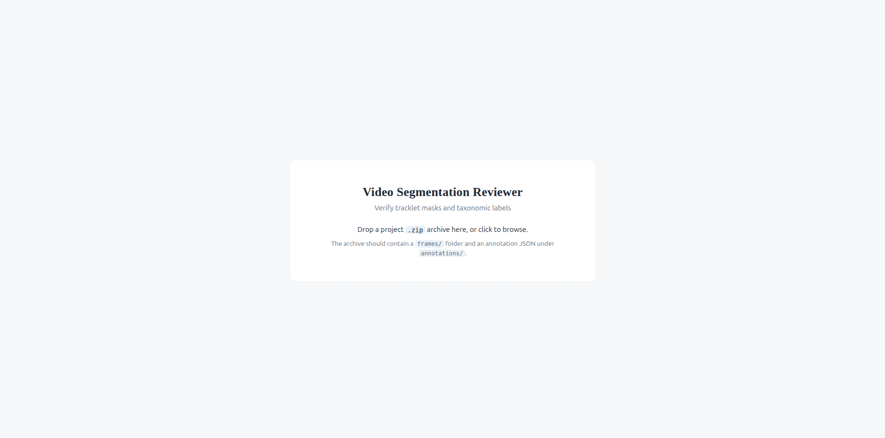
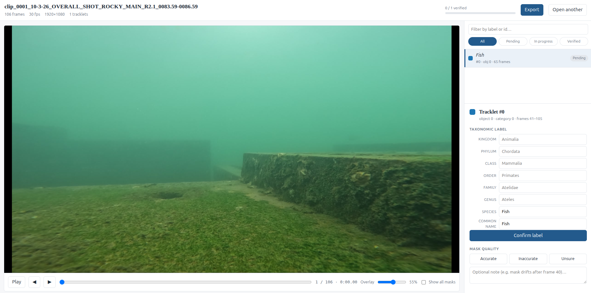
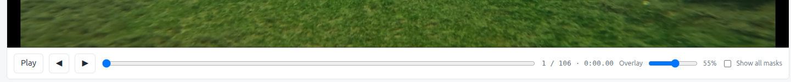
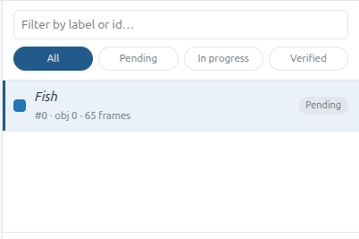
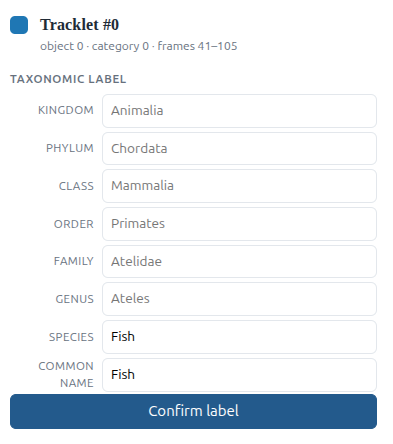
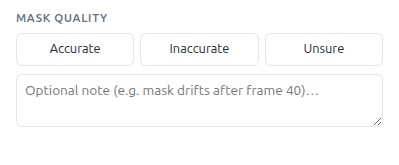

# Video Segmenter — User Guide

Welcome! This guide walks you through reviewing **video instance segmentation** output in the Video Segmenter interface.

In this tool you review one video clip at a time. For each tracked object (a **tracklet**) you will:

1. **Check the mask** — the coloured overlay outlining the animal on each frame.
2. **Check the taxonomic label** — kingdom → species, plus a common name.
3. **Record your verdict** and, if needed, a short comment.
4. **Export** your review so it can feed back into dataset curation.

Everything runs in your browser. Your frames never leave your computer.

---

## Table of contents

1. [Before you start](#1-before-you-start)
2. [Opening a project](#2-opening-a-project)
3. [The workspace at a glance](#3-the-workspace-at-a-glance)
4. [Step 1 — Playing and scrubbing the video](#4-step-1--playing-and-scrubbing-the-video)
5. [Step 2 — Choosing a tracklet](#5-step-2--choosing-a-tracklet)
6. [Step 3 — Inspecting the mask overlay](#6-step-3--inspecting-the-mask-overlay)
7. [Step 4 — Verifying the taxonomic label](#7-step-4--verifying-the-taxonomic-label)
8. [Step 5 — Recording a mask verdict and comment](#8-step-5--recording-a-mask-verdict-and-comment)
9. [Keyboard shortcuts](#9-keyboard-shortcuts)
10. [Tracking your progress](#10-tracking-your-progress)
11. [Exporting your review](#11-exporting-your-review)
12. [Troubleshooting](#12-troubleshooting)
13. [Glossary](#13-glossary)

---

## 1. Before you start

You need two things:

| Requirement | Details |
| --- | --- |
| **A project archive** | A single `.zip` file for one clip. It contains a `frames/` folder (one image per frame) and an annotation JSON under `annotations/`. Your data provider or the `make_projects.py` bundler creates these for you. |

---

## 2. Opening a project

When the app loads you will see the **upload screen**.

**To open a project:**

1. **Drag** the project `.zip` file from your file manager and **drop** it anywhere on the drop zone.
   — *or* —
   **Click** the drop zone to open your file browser, then pick the `.zip` file.
2. A short **"Loading"** screen appears while the app reads frames and annotations.
3. The review workspace opens automatically once the clip is ready.

If the file cannot be opened, you will see a **"Could not open archive"** screen with the reason and a **Choose another file** button. See [Troubleshooting](#12-troubleshooting).

---

## 3. The workspace at a glance

The workspace is divided into three areas:

| Area | What it does |
| --- | --- |
| **① Header bar** | Shows the clip name, technical details (frame count, fps, resolution, number of tracklets), the **review progress bar**, the **Export** button, and **Open another**. |
| **② Video canvas** | Plays the clip and draws the coloured mask overlay for the selected tracklet. |
| **③ Tracklet list** | Lists every tracked object. Search, filter, and click to select. |
| **④ Inspector** | Where you edit the taxonomic label, confirm it, and give the mask a verdict. |

---

## 4. Step 1 — Playing and scrubbing the video

Use the controls beneath the video:

- **Play / Pause** — start or stop playback at the clip's native frame rate.
- **◀ / ▶** — step back or forward exactly one frame. Use this for close inspection.
- **Frame slider** — drag to scrub quickly to any frame.
- **Timecode** — reads `frame / total frames · mm:ss`, so you always know where you are.
- **Overlay** — adjusts the mask transparency from 0% (invisible) to 100% (solid). Lower it to check that the mask still sits on the animal; raise it to see the mask shape clearly.
- **Show all masks** — shows every tracklet's mask at once, each in its own colour. Turn this off to focus on a single object.

> 💡 **Tip:** The canvas scales the video to fit the window while preserving aspect ratio. It will never crop or distort your frames.

---

## 5. Step 2 — Choosing a tracklet

The **tracklet list** on the right is your work queue.

- **Search** — type part of a label, tracklet ID, or object ID to filter the list (for example `Ateles` or `17`).
- **Filter buttons** — narrow the list to the ones you still need:
  - **All** — every tracklet.
  - **Pending** — not reviewed yet.
  - **In progress** — you have confirmed the label *or* given a mask verdict, but not both.
  - **Verified** — label confirmed **and** mask verdict recorded.
- **Click a row** to select that tracklet. Each row shows the colour swatch, the object's label, its IDs, and how many frames it appears in.

> 💡 **Tip:** Selecting a tracklet automatically jumps the video to the **first frame where that object is visible**, so you start in the right place.

---

## 6. Step 3 — Inspecting the mask overlay

With a tracklet selected, only **its** mask is drawn (unless you enabled **Show all masks**).

For each tracklet, step through the frames where it appears and ask:

- Does the mask **tightly follow the animal's outline** on every frame?
- Does it **include background** (too large) or **cut off part of the animal** (too small)?
- Does it **drift, flicker, or jump** between neighbouring frames?
- Does the object stay **consistent** through motion, occlusion, and lighting changes?

Continue to [Step 5](#8-step-5--recording-a-mask-verdict-and-comment) to record your conclusion.

---

## 7. Step 4 — Verifying the taxonomic label

The **Inspector** (bottom right) shows the selected tracklet's label. The pipeline's predicted taxonomy is pre-filled for you to confirm or correct.

The fields run from broadest to narrowest: **Kingdom**, **Phylum**, **Class**, **Order**, **Family**, **Genus**, **Species**, then **Common name**.

**Using the taxonomic autocomplete:**

1. Click into any rank field (**Kingdom** through **Species**) and start typing a name.
2. After a brief pause, a **dropdown of matching taxa** appears (sourced from GBIF, with a WoRMS fallback for marine names).
3. Navigate the suggestions with **↑ / ↓** and press **Enter** to accept, or click one directly.
4. The tool then fills in **your chosen rank and every broader rank above it** (for example, choosing a species fills its genus, family, order, and so on). Narrower ranks are left blank for you to complete if you wish.
5. **Common name** is a normal text field — type it in directly.

> ℹ️ **Note:** If a lookup fails or you are offline, the field still accepts free text. Just type the name manually.

**Confirming:**

When you are happy with the label, click **Confirm label**. A **✓ confirmed** badge appears. If you change any field afterwards, the confirmation is cleared and you must confirm again.

> ⚠️ **Do not confirm a label you are unsure about.** Leaving it unconfirmed keeps the tracklet in the "In progress" filter so it stays on your radar.

---

## 8. Step 5 — Recording a mask verdict and comment

Still in the Inspector, under **Mask quality**, choose one of three verdicts:

> 

| Verdict | When to use it | Shortcut |
| --- | --- | --- |
| **Accurate** | The mask correctly and consistently outlines the animal on all visible frames. | `3` |
| **Inaccurate** | The mask is wrong on one or more frames (too large, too small, drifting, or covering the wrong object). | `4` |
| **Unsure** | You cannot confidently judge the mask (poor visibility, ambiguous boundaries, or heavy occlusion). | *(none — click the button)* |

Optionally, add a note in the **comment box** — for example, *"mask drifts off the tail after frame 40"* or *"partially occluded by foliage, verdict provisional"*. Comments are included in the export and are valuable to downstream curation.

A tracklet is **Verified** when **both** the label is confirmed **and** a mask verdict is set.

---

## 9. Keyboard shortcuts

These shortcuts let you review quickly without reaching for the mouse.

| Key | Action |
| --- | --- |
| `Space` | Play / pause |
| `←` | Step one frame back |
| `→` | Step one frame forward |
| `3` | Verdict mask: **Accurate** |
| `4` | Verdict mask: **Inaccurate** |
| `n` | Jump to the **next unverified** tracklet |
| `x` | Toggle **Show all masks** |

> ℹ️ **Note:** Shortcuts are paused while you are typing in a text field, so you can safely type labels and comments. "Unsure" has no shortcut by design — click the button in the Inspector.

**Recommended review loop:**

1. Press `n` to jump to the next unverified tracklet.
2. Press `Space` to play, or `←` / `→` to step through the frames.
3. Check the mask, then press `3` or `4` (or click **Unsure**).
4. Confirm or correct the label in the Inspector, then click **Confirm label**.
5. Repeat from step 1.

---

## 10. Tracking your progress

The **progress bar** in the header shows how many tracklets are verified, for example **`7 / 24 verified`**.

Each tracklet's status is also shown in the list:

- **Pending** — not started.
- **In progress** — partially reviewed (label *or* mask done, not both).
- **Verified** — fully reviewed.

Your work is **saved automatically** in your browser as you go, so you can close the tab and come back later — just re-open the same project file to resume where you left off.

> ⚠️ **Important:** Review state is stored **per browser on this machine**. Opening the project on a different computer, in a different browser, or after clearing browser data will start from a blank slate. **Export when you finish a clip** to be safe.

---

## 11. Exporting your review

When you have reviewed the clip, click **Export** in the header. Two files download automatically:

1. **`<clip>.review.json`** — the complete structured record: clip metadata plus, for every tracklet, the original pipeline values, your final values, the label confirmation flag, the mask verdict, and your comment.
2. **`<clip>.review.csv`** — the same content as a flat, spreadsheet-friendly table, convenient for quick inspection in Excel, R, or Python.

Both files include the **original** prediction and your **final** decision side by side, so downstream scripts can diff what the model produced against what you concluded.

Click **Open another** in the header to load a different project archive.

---

## 12. Troubleshooting

| Symptom | Cause | What to do |
| --- | --- | --- |
| **"Could not open archive"** mentioning compression or method 14 | The `.zip` uses LZMA/BZIP2, which the browser cannot read. | Ask for a copy re-exported with `--compression deflated` (DEFLATE), or re-bundle it with `make_projects.py`. |
| **"Could not open archive"** with another message | The archive is missing the expected layout, or the annotation JSON is absent. | Confirm the `.zip` contains a `frames/` folder and exactly one `.json` under `annotations/`. |
| **A grey "Frame unavailable" box appears** | One or more frame images are missing from the archive. | The header warns how many frames are missing. Continue reviewing the available frames; notify your data provider if it matters. |
| **No coloured overlay appears on the video** | The mask service is not running, or a mask has not yet loaded for this frame. | Make sure the helper service is running, then select the tracklet again to re-request its masks. |
| **Masks lag briefly during playback** | Masks are being decoded and may arrive a moment after the frame. | This usually resolves within a moment. Step frame-by-frame for the most reliable inspection. |
| **Shortcuts stop working** | Your cursor is inside a text field. | Click on the video canvas or press `Escape`, then try again. |
| **Review progress is empty after reopening** | The project was opened in a different browser/machine, or browser data was cleared. | Re-do the review, and export promptly. Exported files are the durable record. |

---

## 13. Glossary

| Term | Meaning |
| --- | --- |
| **Clip** | One video, represented by one project `.zip` archive. |
| **Frame** | A single still image in the clip. |
| **Tracklet** | One object tracked across frames (one animal), with a mask and a taxonomic label. |
| **Mask** | The pixel-level outline of an object on a frame, drawn as a coloured overlay. |
| **Taxonomy** | The scientific classification of the object: kingdom → phylum → class → order → family → genus → species. |
| **Verdict** | Your judgement of a mask's quality: Accurate, Inaccurate, or Unsure. |
| **Verified** | A tracklet whose label is confirmed **and** whose mask has a verdict. |
| **Export** | The JSON + CSV files containing your completed review. |

---

*Questions or corrections? Flag them to the platform maintainer so this guide can be kept up to date.*
